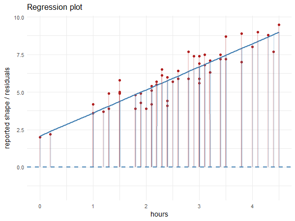

# Week 13

## From last week: Fitting a straight line

Review: What is the code for getting the slopes and p-values of a fitted line?

::: iframe

https://wall.sli.do/event/2ygxsjqUawadj9CePTaGEP/?section=18cb091e-0a22-4de1-8166-34cbb1000484

:::

## 

```r
model1 <- lm(reported_shape ~ hours, data = data)
model1
```
```{r}

library(tidyverse)

data1 <- read_csv("data/shapeVsHours.csv")

model1 <- lm(reported_shape ~ hours, data = data1)

model1
```

## Plotting the line

```r
ggplot(data=data1, aes(x=hours, y=reported_shape)) + geom_point() + geom_smooth(method="lm")
```

```{r}

ggplot(data=data1, aes(x=hours, y=reported_shape)) + geom_point() + geom_smooth(method="lm")

```

## Residuals



## How residuals work

::: panel-tabset

### The gist

$y_\text{model} = \text{intercept} + \text{slope}\times x$

$y_\text{data points} =  y_\text{model} + \text{errors}$

$\text{errors} = y_\text{data points} - y_\text{model}$

By subtracting the line from the individual data points, the slope and intercept are "removed", and all that is left is the noise from individuals. In other words, all that is left are the errors. If the model is the true model, then the true errors are random (by definition, errors are random). The "errors" that a model predicts are the called the residuals.


### Slightly more accurate

$y_\text{model} = \text{intercept}_\text{model} + \text{slope}_\text{model} \times x_\text{data points}$

$y_\text{data points} =  y_\text{model} + \text{errors}_\text{model}$

$\text{errors}_\text{model} = y_\text{data points} - y_\text{model}$


:::

## Getting residuals in R
The `lm()` function in R automatically calculates the residuals for you. 

```r
model1 <- lm(reported_shape ~ hours, data = data1)
residuals <- model1$residuals
print(residuals)
```

```{r}
model1 <- lm(reported_shape ~ hours, data = data1)
residuals <- model1$residuals
print(residuals)
```

## Plotting residuals

```r
data1 <- data1 %>% mutate(resids = model1$residuals)

ggplot(data=data1, aes(x=hours, y=resids)) + geom_point() + geom_smooth(method="lm")
```

```{r}

data1 <- data1 %>% mutate(resids = model1$residuals)

ggplot(data=data1, aes(x=hours, y=resids)) + geom_point() + geom_smooth(method="lm", color = "firebrick")

```

Because residuals are noise, they should look random (no slope or pattern). Something is likely wrong with the analysis if the residuals don't look random.


## Slido: How do these plots compare?

:::: columns
::: column

**Dataset 1: Reported shape vs. hours**

```{r}

ggplot(data=data1, aes(x=hours, y=reported_shape)) + geom_point() + geom_smooth(method="lm") + labs(title="Regression")

```

```{r}

data1 <- data1 %>% mutate(resids = model1$residuals)

ggplot(data=data1, aes(x=hours, y=resids)) + geom_point() + geom_smooth(method="lm", color = "firebrick") + labs(title="Residuals")

```

:::

::: column

**Dataset 2: Heart rate vs. hours**

```{r}

data2 <- read_csv("data/bpmVsHours.csv")
ggplot(data=data2, aes(x=hours, y=bpm)) + geom_point() + geom_smooth(method="lm") + labs(title="Regression")

```

```{r}

model2 <- lm(bpm ~ hours, data=data2)
data2 <- data2 %>% mutate(resids = model2$residuals)

ggplot(data=data2, aes(x=hours, y=resids)) + geom_point() + geom_smooth(method="lm", color = "firebrick") + labs(title="Residuals")

```

:::
::::

## Interpretation

We can see that in the second dataset, there is still a pattern in the residual plot. Specifically, there is an clear curve in residuals. This means that the straight line model that we have fitted to the data is not accounting for all systematic variance. Ideally, we want a model that can capture the true relationship between two variables, so a better model should be chosen to account for more of the systematic patterns. This would result in a plot where the residuals appear randomly scattered, as only errors (like measurement errors, variation do to other unrelated variables, etc.) are left.


## Fitting curved lines using polynomials

Order 1: $y \sim x$

Order 2: $y \sim x^2$

Order 3: $y \sim x^3$

```{r}

x = seq(0, 10, by = 0.01)

`y = x` <- x

`y = x^2` <- x^2

`y = x^3` <- x^3

poly <- tibble(x=x, `y = x`=`y = x`, `y = x^2` = `y = x^2`, `y = x^3` = `y = x^3`)

poly <- poly %>% pivot_longer(names_to = "order", values_to = "y", cols = c(2,3,4))

ggplot(data=poly, aes(x=x, y=y, color = order)) + geom_line() + ylim(0,100)

```

## `poly()` function

Generally:

```r

# Fits a model with an order 1 polynomial (basically equivalent are normal regression models)
lm(data$y ~ poly(data$x, 1))

# Fits a model with an order 2 polynomial
lm(data$y ~ poly(data$x, 2))

```

So to get the residuals for the BPM data using an order 2 polynomial model, we have:


```r

bpm_resids2 <- lm(data2$bpm ~ poly(data2$hours, 2))$residuals
bpm_resids2

```

```{r}

bpm_resids2 <- lm(data2$bpm ~ poly(data2$hours, 2))$residuals
bpm_resids2
```

## Plotting a curved line
Add the formula argument in `geom_smooth` like so

```r
ggplot(data=data2, aes(x=hours, y=bpm)) + geom_point() + geom_smooth(method="lm", formula = y ~ poly(x, 2))
```

```{r}

ggplot(data=data2, aes(x=hours, y=bpm)) + geom_point() + geom_smooth(method="lm", formula = y ~ poly(x, 2))

```

## Deliverables

Download the Rmarkdown file from [monaxue.github.io/420m](http://monaxue.github.io/420m) and work through that file. Since we went over the plots from the first two datasets, feel free to jump to the third dataset at the end. Keep in mind, you will need to load all 3 datasets for the Rmd file to knit, and you will have to compare plots from all 3 datasets in your summary.

