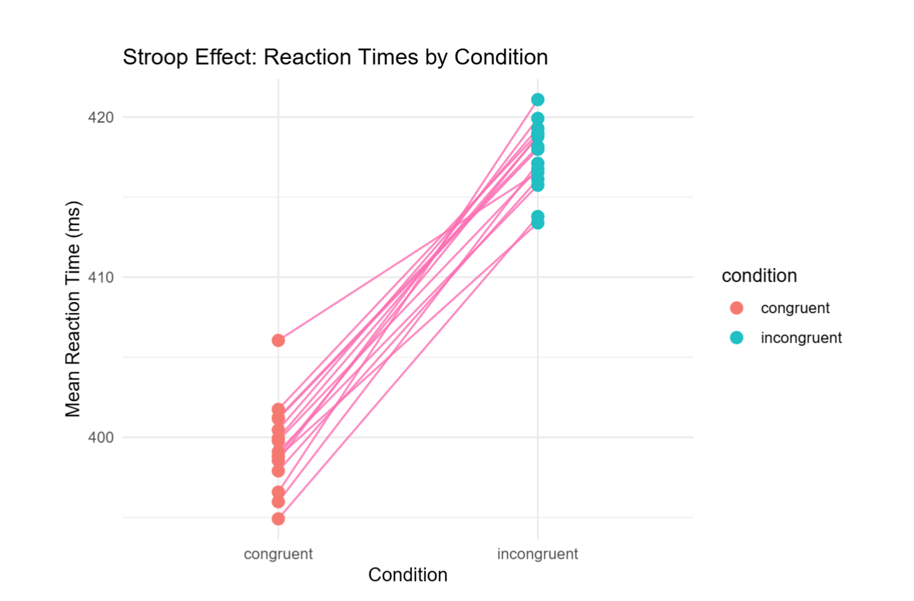
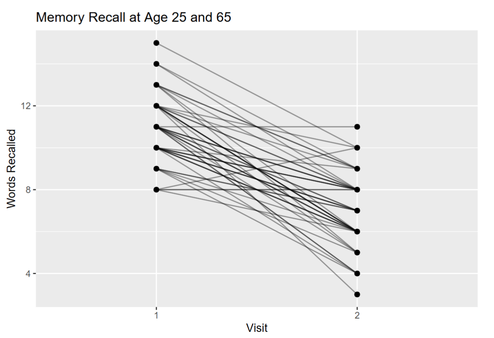
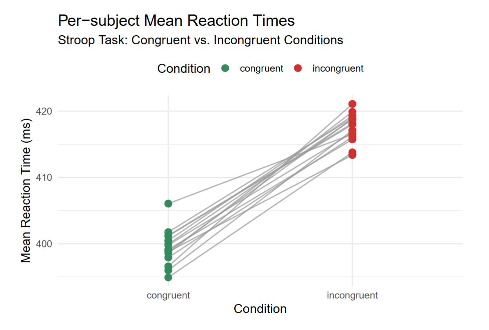
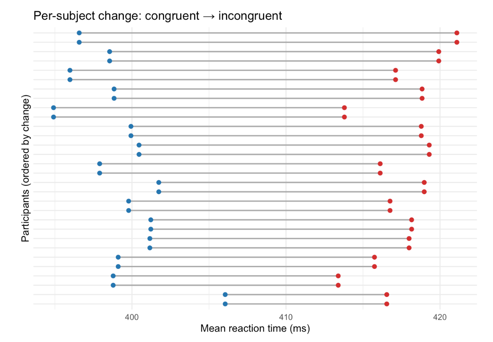
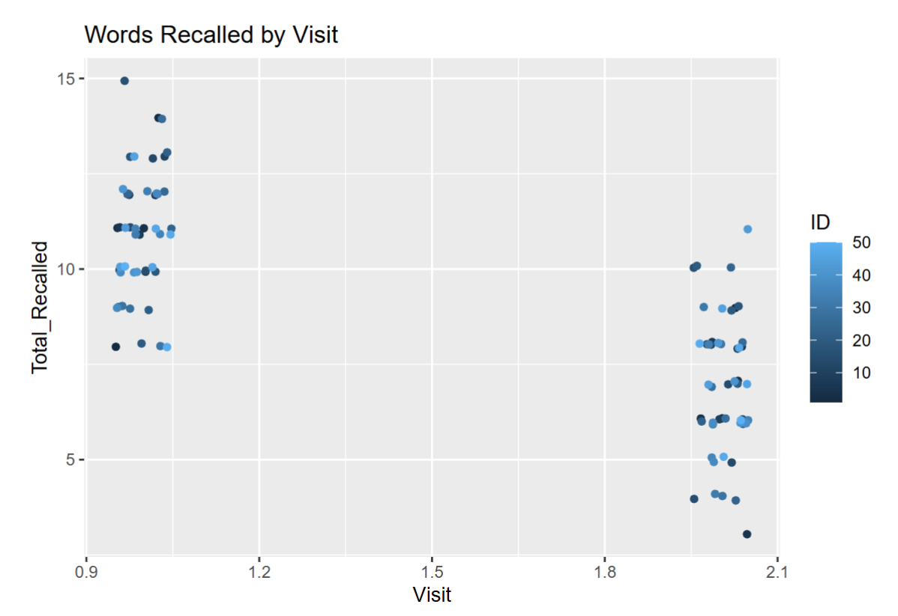

## Case study 3 histogram

```{r}
#| warning: false

library(tidyverse)
library(ggplot2)

lowgrades <- c(8,8,9,9.5,10,10.5,11,11,11.5,12,12.5,12.5,13,13.5)
highgrades <- rep(15,11)
grades <- c(lowgrades,highgrades)
gradesdf <- tibble(id=1:length(grades), grades=grades)

summary <- gradesdf %>% summarize(Mean=mean(grades), Median=median(grades), SD=sd(grades))

ggplot(gradesdf, aes(x=grades)) + theme_classic() + geom_histogram(binwidth = 0.5, color="black", fill="grey") + scale_x_continuous("Grades", breaks=0:15) + ylab("Counts") + geom_vline( xintercept=summary$Mean, color = "firebrick", 
linewidth=1) + geom_vline( xintercept=summary$Median, color="steelblue", linewidth=1)

```

```{r}

knitr::kable(summary)

```

## Key reasons why you don't get 100%

::: card-list

1. You forget to include 
	- Explanation of code from outside sources
	- Interpretations
	- Mean/CI plots
2. Improper interpretations
	- Forgetting what interpretations you can draw from histograms and boxplots
	- Subjectivity of "significance"
	- Significance $\neq$ proof

:::

## By answering today's Slido questions correctly, you will get a chance to earn some points back on your Case Study 3 (or extra credit)

::: iframe

https://wall.sli.do/event/inJn94aUXfX34w1wGUWuzj/?section=a3e6a3fb-5812-4344-a61c-f033118ae11c

:::


<!---

## What the difference between a paired and standard t-test?
1. A standard t-test compares the means of two separate, independent groups. A paired t-test compares the difference between the means of two related groups. 
2. A standard t-test compares the mean values of two groups. A paired t-test compares the values for each individual.

## What is a confidence interval?

## What is a p-value?

## How do you analyze the sampling distribution?
- You use geom_histogram() on the raw data and compare the mean to zero.
- You use geom_histogram() on the raw data and see if the distribution contains zero.

## Interpreting histograms

## Compare and contrast these plots
There is something that can be improved upon in every one of these plots. What are they?
- [ ] Redundant information should be removed
- [ ] Points should be unhidden
- [ ] The scale of x-axis should be discrete

- Answer: None of these are technically wrong. But:
	- Ensure that all points are unhidden (you can use geom_jitter())
	- It is better not to have redundant information in a plot. If a variable already is labeled on the x-axis, it is best not to color it by the same variable.
	- We have learned in class of a similar plot, it looks like this:
	- Notice: This plot is colored by id. You should explain why you prefer your plot over the one we learned in class.
- 


--->

##


##


##


##


##



## Actual case study 4 rubric
This time, I will lay out the expectations more clearly IN TEXT

::: {.card-list .nonincremental}

- Formatting
	- Rmarkdown PDF or HTML
	- Properly labeled figures
	- Summary tables that are printed out
	- Descriptions for each plot
	- Code is clearly readable and does not run off the page
- Sections
	- Introduction (1 point)
		- Description of the study and research question
	- Code and plots (4 points)
		- This section includes your code, summary tables, and plots
		- Summary table with mean and SD: 1 point
		- Plot 1 - Histogram/Freqeuncy polygon (which one is better for a continuous variable?): 1 point
		- Plot 2 - Regression plot: 1 point
		- Statistical analysis (Regression): 1 points
	- Interpretations (6 points)
		- This section includes interpretation of plots, p-values and their interpretations, confidence intervals and their interpretations, and general conclusions for the study.
		- Plot 1 description and interpretation: 1 point
		- Plot 2 description and interpretation: 1 point
		- CI estimate based on `geom_smooth()` plot (does it include a slope of zero?): 1 point
		- CI interpretations: 1 point
		- Report p-value: 1 point
		- p-value interpretations: 1 point
		- General conclusions: 1 point
	- External sources: 3 points
		- This section that lists any code, plots, or concepts that we did not learn from this class. If you did not use any external sources, still include this section, and just write "I did not use any external sources."

:::

# Section details
## Interpretations

::: {.card-list .nonincremental}

- Distribution plot description/interpretation
	- What is the shape of your distribution? Make sure not to over interpret your plots (see week 6)
- Mean/CI plots
	- Are there any overlaps? What does that mean?
	- Again, make sure not to over interpret your plots
- Confidence interval interpretations (see week 6)
	- What does a CI interval represent?
	- What does this CI tell us?
- If conducting a t-test:
	- p-value interpretations. What does a p-value represent? What does this 
	- If paired: what does a paired t-test do and how is it different from a standard t-test?

:::

## External sources:

::: {.card-list .nonincremental}

- For code: make sure to label your code in the "Code and plots" section with comments formatted like so: # ES1, # ES2, # ES3, etc. Then, in this section, reference your external code as ES1, ES2, ES3, etc.
- For plots and concepts: just make sure it's clear what you are referring to.
- For each, please explain:
	- Why you chose to use it rather than existing material from class
	- Where you learned them from. Choose from:
		- Previous class
		- Online forum or blog post (include link)
		- Formal documentation (include link)
		- AI Chatbot (include type, e.g., ChatGPT, Gemini, Copilot, etc.)
		- Other, please explain
- Valid examples:
	- ES1: I chose to use filter() because that lets me select data for only for "females" in fewer steps than using a combination of $ or []. I learned to use filter() from the official dplyr documentation at https://dplyr.tidyverse.org/reference/filter.html
	- Density plot: I chose to use a density plot instead of a histogram or frequency polygon because there is a large sample size and we have a continuous variable, so it is better represented by a plot that shows a smooth, continuous line, rather than a histogram which plots discrete data, or a frequency polygon, which, although it is for continuous variables, tends to look fairly jagged. I learned to plot density plots in a previous statistics class.
- Problematic examples:
		- I used na.rm = TRUE to get rid of any missing data. 
			- This example is problematic because there is no missing data in the case studies. Furthermore, it does not mention where they learned this line of code.
		- I used .groups = "drop" to drop the groups.
			- This is not a real explanation.

:::

## Deliverables for today

::: card-list
- A reflection of this semester: 
	- How did you feel about your performance in this class?
	- What were your biggest takeaways from this class? 
	- What could I have done to improve your learning process in this class?
	- If you want to gain back some points on case study 3: What revisions would you make for your case study 3?
:::


## It's time to work on Case Study 4!
**Useful functions**

::: {.card-list .nonincremental}

- `filter()` (Check out the `dplyr` documentation, I will now consider this as learned in class)
- `facet_wrap()`
- `lm()` (with `summary()`)
- `geom_smooth()`

:::
