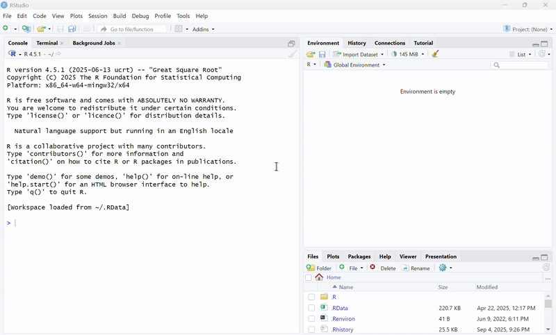
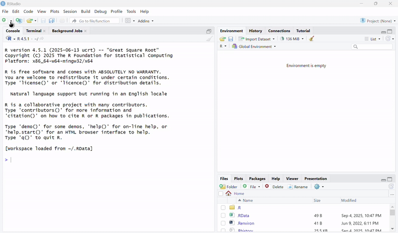
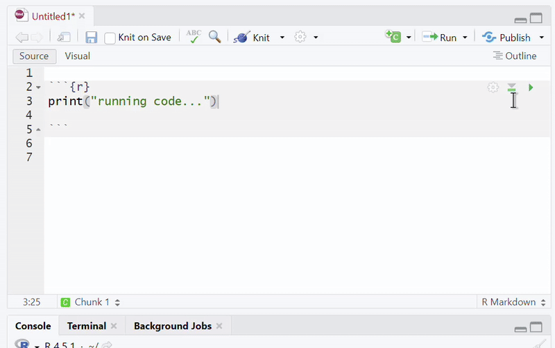

# Week 2

## Office hours
:::{.card-list}
- My office hours will be right after class.
:::

## 
::: card-list
- It might be useful to open the slides for today from the lab website

    - <https://monaxue.github.io/420m/>

:::

## Make a folder for this class

:::{.card-list}

- Create a folder somewhere named `420m`
    - Home, documents, desktop. etc
    - Do not create it in a cloud service (iCloud, OneDrive, etc.)
    - Do not create it in downloads

:::

## Make sub-folders

::: card-list
- Inside `420m`, create a folder called `lab2`
- The organization should look like: `…/420m/lab2`
:::

## What is an RStudio project?

::: {.card-list}
- A project tells RStudio which folder is the main folder
- That way, when you read or save files, R will know where to find them.
- We will make a new project for each lab
:::

## Now, create an RStudio project

:::{.card-list}
- To create a project, click on `Project > New Project > Existing Directory`
- Select your `lab1` folder
- 
:::


## What is RMarkdown?

::: card-list

- RMarkdown is a special type of file that combines the functions of R and Word.
- This means you can format documents directly in R
- [Example](assets/rmarkdown_example.html){.filelink}

:::

## Creat an RMarkdown file


Create an **empty** RMarkdown file



## Save the file

Save this Rmd file in your lab2 folder. Name it something like "lab2"

## Experiment with the `#` symbol
::: card-list

- On one line, write the following text: `Hello, my name is [fill in your name]`
- Test the following out by knitting the file
    - What happens with you start a line with `#`?
    - What happens when you include/remove the space between `#` and the rest of the text?
    - What happens when you start a line with `##`

<!--

Answers:

    - What happens with you start a line with `#`?
        - The text becomes a big title.
    - What happens when you include/remove the space between `#` and the rest of the text?
        - The space after `#` is important for the title to render properly.
    - What happens when you start a line with `##`
        - It becomes a smaller title.

-->

:::

## Slido

<!--
::: card-list
- What does # Text output?
- What does #Text output?
- What does ## Text output?

:::

-->


::: iframe
https://wall.sli.do/event/6rHvxkU74cKLRinjZHrsGz
:::


## Try wrapping text with the following:


````{verbatim}
```{r}

{text to wrap}
    
```
````

::: card-list

- Hint: Those symbols are called a `backticks`, not `'quotes'`. You can find the symbol right below the `esc` key.
- Remember to include both ` ```{r} ` above and ` ``` ` below.
- What happens when you wrap
    - Text that start with `#`
    - Plain text
    - `print(1+1)`
:::

## Slido


::: iframe
https://wall.sli.do/event/6rHvxkU74cKLRinjZHrsGz
:::

<!--

## What happens?

::: card-list
- What happens when you wrap lines that start with `#`?
    - They become comments.
- What happens when you wrap plain text lines?
    - The file doesn't knit
- Try wrapping that around the following text: `print(1+1)`.
    - It prints 2
:::

-->

## R code chunks

::: card-list

- Wrapping text in ` ```{r} ` and ` ``` ` makes them into r code. These are called r "code chunks"
- To see if text has been properly wrapped, makes sure that the lines turned grey.
- To run individual code chunks, click on the little triangle icon.
    - 

:::

# Basic `R` code review

## What does this output?

````{verbatim}
```{r}
a <- 1
print(a)
```
````

<!-- Answer: 1 -->

::: iframe
https://wall.sli.do/event/6rHvxkU74cKLRinjZHrsGz
:::

## What does this output?

````{verbatim}
```{r}
b <- 1:3
print(b)
```
````

<!-- Answer: 1, 2, 3 -->

::: iframe
https://wall.sli.do/event/6rHvxkU74cKLRinjZHrsGz
::: 


## What does this output?

````{verbatim}
```{r}
c <- c(3,4,5)
print(c)
```
````

<!-- Answer: 3, 4, 5 -->

::: iframe
https://wall.sli.do/event/6rHvxkU74cKLRinjZHrsGz
::: 

## What does this output?

````{verbatim}
```{r}
c <- c(3,4,5)
c[4] <- 6
print(c)
```
````

<!-- Answer: 3, 4, 5, 6 -->

::: iframe
https://wall.sli.do/event/6rHvxkU74cKLRinjZHrsGz
::: 

## What does this output

````{verbatim}
```{r}
a <- 1:4
b <- c(2,3,5,6)
b[3] <- 2
c <- c(a,b)
print(c)
```
````

<!-- Answer: 1, 2, 3, 4, 2, 3, 2, 6 -->

::: iframe
https://wall.sli.do/event/6rHvxkU74cKLRinjZHrsGz
:::


## Reading data

::: {.card-list .nonincremental}

1. Download `2020_heights.csv` and save it you your `lab2` folder.
1. Import the data into R

````{verbatim}
```{r}
library(tidyverse)
lab2_data <- read_csv("2020heights.csv")
```
````

- Note: make sure to use `read_csv`, and not `read.csv`
1. Use `head(lab2_data)` to take a peak at the dataset.

:::

## What are the variables of this dataset?

::: iframe
https://wall.sli.do/event/6rHvxkU74cKLRinjZHrsGz
:::

<!-- Answer: Just `heights`-->

## Add the title, author, date
::: {.card-list .nonincremental}

- At the very top of the document, add a section by enclosing it with `---`

- Let me show you in R

````{verbatim}
---
title: lab2
author: Mona Xue
date: 2026-01-23
---
````

- Note: date is in `yyyy-mm-dd` format

:::

## Deliverables

::: {.card-list .nonincremental}
1. Create a new EMPTY RMarkdown file.
1. Add the tile, author, and date, enclosed with `---`
1. Add a large heading that says `Code`. Beneath this, include
    - One `r` code chunk that:
        - starts with a comment that says "Load packages"
        - loads the tidyverse packages using `library()`
        - imports `test_data.csv` using `read_csv()`     
    - A second `r` code chunk. In this chunk,
        - create a list of numbers from 1 to 3. Assign this to the variable `a`
        - create a list of numbers from 4 to 9. Assign this to `b.
        - change the 3rd element of `b` to 3.
        - create a new list by combining `a` and `b`. Assign this to `c`
        - print the list `c` by using `print(c)`
1. Add a large heading that says `About me`. Beneath this, write a short paragraph in plain text answering the following:
    - Who are you? 
    - How would you describe your personality? 
    - What are you passionate about? 
    - What are your hobbies?
1. Knit the file, then show it to me.
1. Finally, sumbmit the html file to Canvas. Once you are finished, you may leave.
:::


