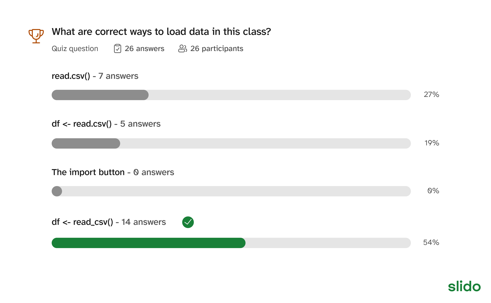
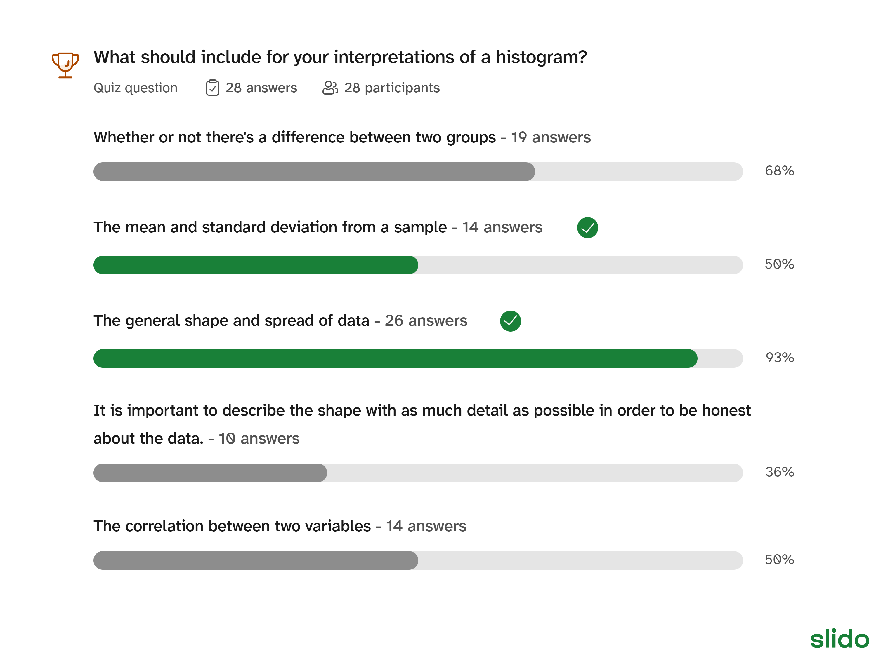

## Week 4 Lab

::: notes
This week as it is went over by an hour. You need to take stuff out!
:::

::: {.card-list .nonincremental}
As always:

1. Create your lab4 folder
1. Create your R studio project
1. Create & save your lab4.Rmd file
1. Add the title, author, and date to the Rmd file.
1. Load `tidyverse` and `ggplot2` using the `library()` function.
:::

## Retrieval practice
::: card-list
- Trying to retrieve information helps us learn, even if we don't think we remember.
- Without looking at your notes, try your best to answer the following questions
:::

. . .

<!--

::: iframe
https://wall.sli.do/event/hyYKBnnVdyaKSNij3VurBg
:::

-->

##

::: card-list

- Given that the dataframe is called `df` and the column name is called `values`, what is the code for a basic histogram using ggplot2?
    - `ggplot(data=df, aes(x=values)) + geom_histogram()`    
- What is the main function of a for loop?
    - To repeat stuff
- What is the general code for a for loop?
    
    ```r
        for (person in 1:3){
            # code to repeat
        }
    ```
:::

::: notes

After brain dump, ask for 5 volunteers for demonstration

:::


## Simulate male heights
Last week, we ended by simulating female heights. Now, let's simulate 200 male heights.

::: {.card-list .nonincremental} 
- Average height is 69 inches
- Gentics contribution: randomly sample one number between -6 to 6.
- Nutritional contribution: randomly sample one number between -3 to 3.
- Third causal variable: exactly the same as what you used last week.
- The final height is the combination of of the average height, and all causes.
- Create a dataframe from this using `tibble()`. Assign it to the variable `df_men`
:::

## What are correct ways to load data in this class?



## Now load data

::: card-list
1. Copy the heights csv file that you simulated from last week into the lab4 folder.
1. Load the data into lab4.Rmd using read_csv(), and assign it to the variable `df_women`
:::

## Combining the two dataframes
We want to combine `df_women` and `df_men` into one big dataframe, while still remembering which data is for women or men.

::: card-list
1. Add a new column to each dataframe to denote sex.
2. Combine the two dataframes

:::

## 1. Add columns with `mutate()`

::: card-list
- We want to add a column title `sex` to both `df_women` and `df_men`
- We use %>% (called "pipes") to apply a function to a dataframe. 

    ```r
    df_women <- df_women %>% mutate(sex='f')
    df_men <- df_men %>% mutate(sex='m')

    ```

:::

## 2. Combine `df_women` and `df_men` into one dataframe

```r
df_both <- bind_rows(df_women, df_men)
head(df_both)
```


```{r}

library(tidyverse)
library(ggplot2)

height_sims <- c()

for (person in 1:200){
  avg_height <- 64
  genetics <- sample(-5:5,size=1)
  nutrition <- sample(-2:2, size=1)
  exercise <- sample(-3:3, size=1)
  height_sims[person] <- sum(avg_height, genetics, nutrition, exercise)
  
}

df_women <- tibble(heights=height_sims)

height_sims <- c()

for (person in 1:200){
  avg_height <- 69
  genetics <- sample(-6:6,size=1)
  nutrition <- sample(-3:3, size=1)
  exercise <- sample(-3:3, size=1)
  height_sims[person] <- sum(avg_height, genetics, nutrition, exercise)
  
}

df_men <- tibble(heights=height_sims)

df_women <- df_women %>% mutate(sex='f')
df_men <- df_men %>% mutate(sex='m')

df_both <- bind_rows(df_women, df_men)
head(df_both)
```

Make sure you have two columns


## Creating a column based on the values of another column

::: card-list
- We can create a column named `Mean` that calculates the mean of heights like so:

    ```r
    df_mutated <- df_both %>% mutate(Mean=mean(heights), heights_plus_one = heights + 1)
    ```

- Again, we use %>% ("pipes") to apply a function to a dataframe
- What do you notice about all the numbers in the Mean column?
    - They are the same

:::

<!--

. . .

::: iframe
https://wall.sli.do/event/hyYKBnnVdyaKSNij3VurBg
:::

-->

## Apply functions to each group with group_by()

::: card-list
- %>% (pipes) can be chained together
- We can use pipes to add the `group_by()` before using mutate.

    ```r
    df_mutated <- df_both %>% group_by(sex) %>% mutate(Mean=mean(heights))
    ```

- Compare the above with the previous version without the group_by(). What's the difference?
    - They are the within each sex, but different between

    
:::

<!--

. . . 

::: iframe
https://wall.sli.do/event/hyYKBnnVdyaKSNij3VurBg

:::

-->

## Note: The following two slides are import for the upcoming case study assignment. 

## Descriptive statistics
:::: panel-tabset

## What is it?

::: {.card-list .nonincremental}
- What is descriptive statistics?
    - Descriptive statistics describes larger trends in the data, without making claims about the true population values.
:::

## Summary table

::: {.card-list .nonincremental}
- Compare the following to the version with `mutate()`. How do they differ?
    - Note: this is an incomplete summary table. Please read more below!

    ```r
    summary_table <- df_both %>% group_by(sex) %>% summarize(Mean=mean(heights))
    summary_table
    ```

- Complete summary table should fill in the following

    ```r
    summary_table <- df_both %>% group_by(sex) %>% summarize(Mean=mean(heights), SampleSize = ..., SD = ..., SE = ...)
    summary_table
    ```

    - SD is standard deviation and SE is standard error.
    - The function to calculate the sample size is just `n()`
    - The function to calculate SD is `sd(height)`
    - To calculate SE, that is SD/sqrt(SampleSize)

- Output from complete code:
```{r}
summary_table <- df_both %>% group_by(sex) %>% summarize(SampleSize=n(),Mean=mean(heights), SD = sd(heights), SE=SD/sqrt(SampleSize))
summary_table
```

:::


## Histogram
::: {.card-list .nonincremental}
- Use `facet_warp(~sex)` to create a separate panel for each sex.
    
```r
ggplot(...) + geom_histogram() + facet_wrap(~sex)
```
```{r}

ggplot(df_both, aes(x=heights)) + geom_histogram() + facet_wrap(~sex)
```

:::

## Frequency polygon
::: {.card-list .nonincremental}
- Use `facet_warp(~sex)` to create a separate panel for each sex.
 
```r
ggplot(...) + geom_freqpoly() + facet_wrap(~sex)
```
:::

```{r}
ggplot(df_both, aes(x=heights)) + geom_freqpoly() + facet_wrap(~sex)
```

## Boxplot

::: {.card-list .nonincremental}
- For boxplots, you need both the x and y variable in aesthetics.
- What should the x and y variables be?
:::

```r
ggplot(...) + geom_boxplot()
```


```{r}
ggplot(df_both, aes(x=sex, y=heights)) + geom_boxplot()
```

## Interpretations



::: notes
- What should include for your interpretations of a histogram?
    - Whether or not there's a difference between two groups
    - The mean and standard deviation from a sample
    - The general shape and spread of data
    - It is important to describe the shape with as much detail as possible in order to be honest about the data.
    - The correlation between two variables
- Common mistake: tendency to overinterpret.
:::

::::


## Inferential statistics

:::: panel-tabset

## What is it?

::: {.card-list .nonincremental}
- What is inferential statistics, and how does it differ from descriptive statistics?
    - Inferential statistics tries to guess the true population based on the sample we have.
:::

::: iframe
:::

## Confidence Intervals

::: {.card-list .nonincremental}
- You can use the summary table to calculate the confidence interval
- The Lower 95% CI is calculated as `Mean-1.96*SE`
- The Upper 95% CI is calculated as `Mean+1.96*SE`
- You can obtain just the CIs by using `select()`, with the columns you want as input.

```r
summary_table <- summary_table %>% mutate(LowerCI = Mean-1.96*SE, UpperCI = Mean+1.96*SE)
CIs <- summary_table %>% select(sex, LowerCI, UpperCI)
CIs
```

```{r}
summary_table <- summary_table %>% mutate(LowerCI = Mean-1.96*SE, UpperCI = Mean+1.96*SE)
CIs <- summary_table %>% select(sex, LowerCI, UpperCI)
CIs
```

:::

## Mean and CI plot

::: {.card-list .nonincremental}
- Plots the mean and the CI for each group
- First, we plot the mean using geom_point()
- Then we plot CI using geom_errorbar
- Like for the boxplot, we need both x and y in aes(). What are they?
:::

```r
ggplot(data=summary_table, aes(...)) + geom_point() + geom_errorbar(aes(ymin = LowerCI, ymax=UpperCI)) 
```

```{r}
ggplot(summary_table, aes(x=sex,y=Mean)) + geom_point() + geom_errorbar(aes(ymin = LowerCI, ymax=UpperCI))
```

## Interpretations


Example: The confidence intervals for male and female height do not overlap, which means that the true means are likely actually different, where the mean male height is higher than the mean female height.

::: notes
- What should you include in your CI interpretations?
    - Whether or not the CIs overlap
    - If the p-value is below 0.05, it is a significant difference
    - The objective answer to research question
    - Whether or not we have proved our hypothesis correct
    - The strength of results to support our hypothesis.
:::

::::


## Deliverables
As always, you can leave after you check in with me and submit your assignment. Double check your work with ~2 people before asking me to check your work. Then you can all wait less and leave sooner!

::: {.card-list .nonincremental}
1. All the code we used to generate the final dataset that includes both women and men's heights
2. Descriptive statistics
    - Summary table
    - Either a histogram, frequency polygon, or boxplot
    - Interpretations
3. Inferental statistics
    - Confidence intervals
    - Mean and CI plot
    - Interpretations
:::